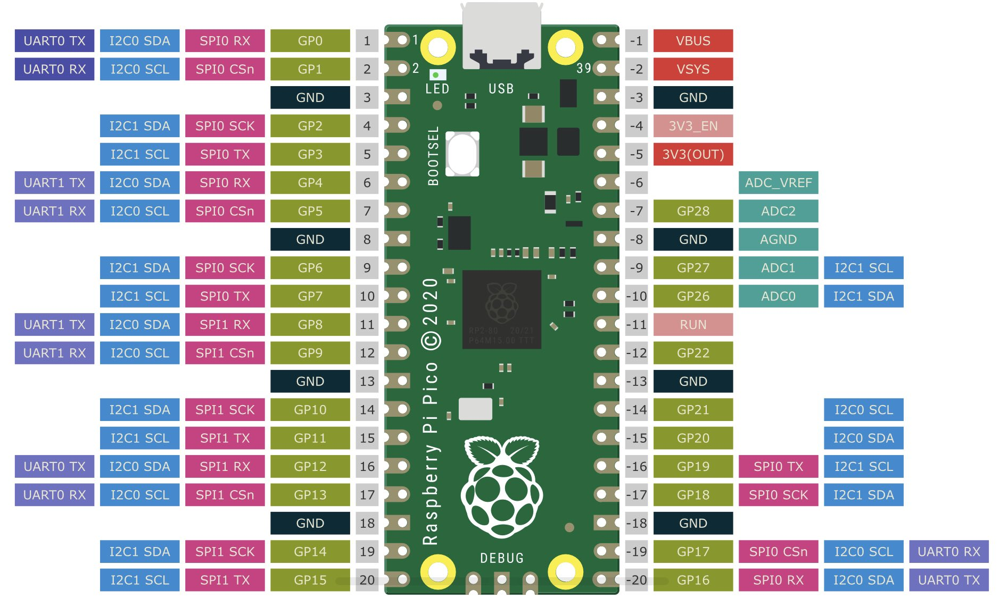

# Black Magic Probe With Raspberry Pi Pico

**Disclaimer**: The project does not work. Could not manage to make BMP using BluePill to talk to Raspberry Pi Pico. The repository will only act as notes/reference for future endeavors.

## Wiring

| BMP (Blue Pill) | Function    | Raspberry Pi Pico            |
| --------------- | ----------- | ---------------------------- |
| GND             | GND         | GND                          |
| SWCLK (37)      | SWCLK       | SWCLK (Serial Wire Clock)    |
| SWIO (34)       | SWDIO       | SWDIO (Serial Wire Data I/O) |
| B4              | nRST/JNTRST | RESET/RUN                    |
| A3 (13)         | TRACESWO    |                              |

## Testing

```bash
# Target STM32F103 Blue Pill
# BMP          Target
# -------------------
# SWD    <-->  SWD
# SWCLK  <-->  SWCLK
# PB4    <-->  Reset
# 3V3    <-->  3V3
# GND    <-->  GND

$ arm-none-eabi-gdb
# GNU gdb (Arm GNU Toolchain 12.2.Rel1 (Build arm-12.24)) 12.1.90.20221210-git
# ...

(gdb) target extended-remote /dev/ttyBmpGdb
# Remote debugging using /dev/ttyBmpGdb

(gdb) monitor swdp_scan
Available Targets:
No. Att Driver
 1      STM32F1 medium density M3

# -----------------
# Target Raspberry Pi Pico

(gdb) monitor swdp_scan
SW-DP scan failed!
Failed

```

## Raspberry Pi Pico Pinout



## References

- [Learn how to Program and Debug Raspberry Pi Pico with SWD](https://www.electronicshub.org/programming-raspberry-pi-pico-with-swd/)
- [Raspberry Pi OpenOCD](https://github.com/raspberrypi/openocd)
- [Install Arm GNU Toolchain on Ubuntu 22.04](https://lindevs.com/install-arm-gnu-toolchain-on-ubuntu)
- [Flashing the NRF52840 with a Blackmagic Probe SWD/JTAG Programmer](https://bluetun.serverbox.ch/2020/01/10/flashing-the-nrf52840-with-a-blackmagic-probe-swd-jtag-programmer/)
- [Using files and devices in Podman rootless containers](https://www.redhat.com/sysadmin/files-devices-podman)
- [Rootless podman using --device and --group-add keep-groups not working as expected](https://github.com/containers/podman/issues/10166#issuecomment-829474672)
- [Flashing RP2040 fails if NRST pin is connected](https://github.com/blackmagic-debug/blackmagic/issues/1013)
- [Programming RP2040 with ST-LINK](https://electronics.stackexchange.com/questions/592979/programming-rp2040-with-st-link)
